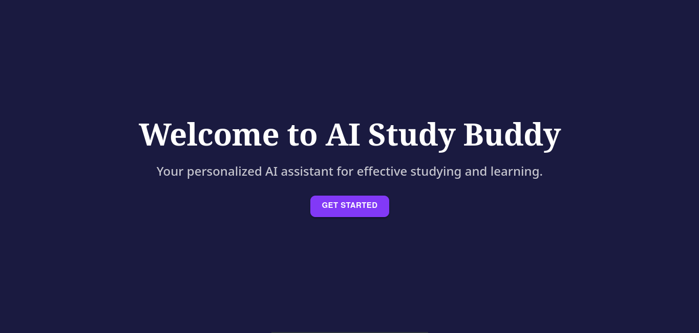
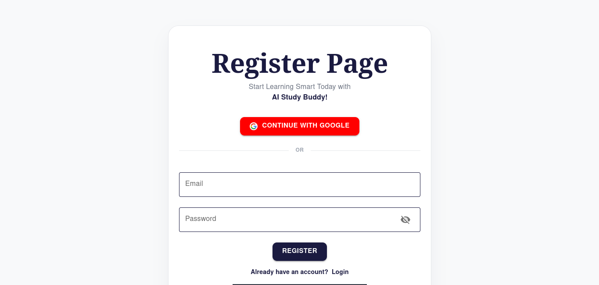
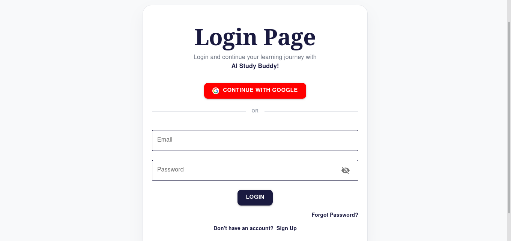
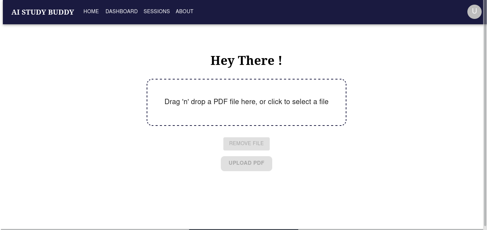

# 🧠 AI Study Buddy

> **An AI-powered study platform that transforms PDF notes into personalized revision sessions using Retrieval-Augmented Generation (RAG).**

🚧 **Status:** Active Development

---

## 🎯 Project Goal

AI Study Buddy is a production-oriented AI learning platform designed to help students study more effectively using their own learning materials.

Students upload PDF notes, receive AI-generated revision questions, answer them, and get personalized AI feedback to reinforce understanding and identify knowledge gaps.

This project is being built to explore modern software engineering practices while designing scalable AI-powered systems.

---

# ✨ Features

## ✅ Current Progress

### Authentication

* User Registration
* User Login
* JWT Authentication
* Protected Routes
* Secure Password Hashing

### Document Management

* PDF Upload
* Session Creation
* File Storage

### Backend

* REST API
* PostgreSQL Database
* Layered Architecture (Controller → Service → Model)

### AI Infrastructure

* Dedicated FastAPI AI Microservice
* Express ↔ FastAPI Communication
* Production RAG Pipeline *(currently under development)*

### Upcoming

* AI Question Generation
* AI Answer Evaluation
* Personalized Feedback
* Dashboard Analytics
* Session History
* Learning Insights

---

# 🏛️ Architecture

```text
                 React Frontend
                        │
                        ▼
                Express Backend
                        │
         ┌──────────────┴──────────────┐
         ▼                             ▼
 PostgreSQL Database          FastAPI AI Service
                                         │
                                         ▼
                              Retrieval-Augmented
                                 Generation (RAG)
```

---

# 🧠 AI Pipelines

## Question Generation Pipeline

```text
PDF Upload
      │
      ▼
Loader
      │
      ▼
Cleaner
      │
      ▼
Recursive Text Splitter
      │
      ▼
Embeddings
      │
      ▼
Vector Store
      │
      ▼
Retriever
      │
      ▼
Question Generator
      │
      ▼
Validator
      │
      ▼
Questions + AI Reference Answers
```

---

## Answer Evaluation Pipeline

```text
Student Answers
        │
        ▼
Evaluation Pipeline
        │
        ▼
LLM Evaluation
        │
        ▼
Validator
        │
        ▼
Feedback Objects
        │
        ▼
Feedback Database
```

The evaluation pipeline compares student answers against AI-generated reference answers to provide meaningful feedback instead of simply marking responses as correct or incorrect.

---

# 🏗️ Engineering Decisions

This project intentionally follows software engineering principles commonly used in production systems.

Key design decisions include:

* Dedicated FastAPI AI microservice to isolate AI processing from application logic.
* Modular Retrieval-Augmented Generation (RAG) architecture where each component has a single responsibility.
* Layered backend architecture (Controller → Service → Model) to improve maintainability.
* Separate AI Question Generation and Answer Evaluation pipelines.
* PostgreSQL used as the primary relational database.
* JWT-based authentication for secure access.
* Metadata preserved throughout the RAG pipeline to support future retrieval improvements.
* Configuration centralized to simplify experimentation and maintenance.
* Continuous documentation maintained alongside implementation.

Every major architectural decision is documented throughout the development process.

---

# 🛠️ Tech Stack

## Frontend

* React
* Tailwind CSS
* React Router
* Axios

## Backend

* Node.js
* Express.js
* PostgreSQL
* JWT Authentication
* Multer

## AI Service

* Python
* FastAPI
* LangChain
* Sentence Transformers
* FAISS *(in progress)*

---

# 📸 Application Preview

## Landing Page



---

## Register Page



---

## Login Page



---

## Starter Page



---

# 📂 Repository Structure

```text
AI-study-buddy/

├── frontend/
├── backend/
├── ai-service/
├── documentation/
├── assets/
└── README.md
```

---

# 🚀 Roadmap

## Phase 1 ✅

* Authentication
* PDF Upload
* Session Management

## Phase 2 🚧

* Production RAG Pipeline
* Question Generation
* Question Storage

## Phase 3

* AI Answer Evaluation
* Personalized Feedback
* Dashboard Analytics
* Session History

## Phase 4

* AI System Design
* AI system Evaluation
* PERN System Design
* Deployment

---

# 📚 Documentation

Technical documentation is written alongside development and currently includes:

* Project Documentation
* Engineering Decisions
* PERN System Design
* AI System Design
* Database Design
* API Documentation
* Security Considerations
* RAG Documentation
* Evaluation Pipeline Documentation

---

# 🎓 Why This Project?

This repository is more than a portfolio project.

It documents the process of designing and building a production-style AI application from the ground up while applying software engineering best practices.

The project focuses on:

* AI System Design
* Backend Architecture
* Retrieval-Augmented Generation (RAG)
* AI Evaluation
* Clean Code
* Production Software Engineering
* Documentation-Driven Development

---

# 👩🏽‍💻 About Me

Hi, I'm **Faith Mutanu**, a Computer Science student passionate about building AI-powered software systems.

I'm currently focused on becoming an **AI Full Stack Developer**, combining modern full-stack development with practical AI system design to build scalable, production-ready applications.

This repository documents my learning journey as I design, build, and continuously improve real-world AI software.

---

## ⭐ Repository Status

This project is actively being developed and improved.

New features, architectural improvements, and documentation are added continuously as the system evolves.
